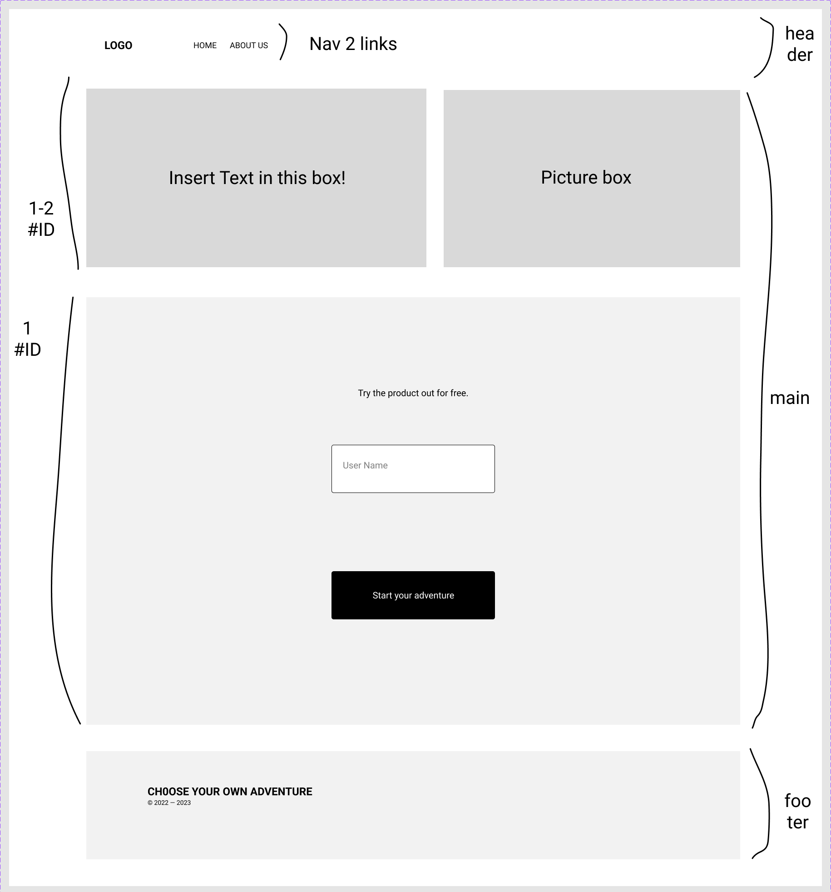
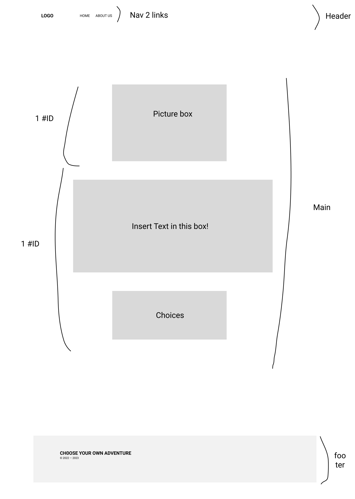
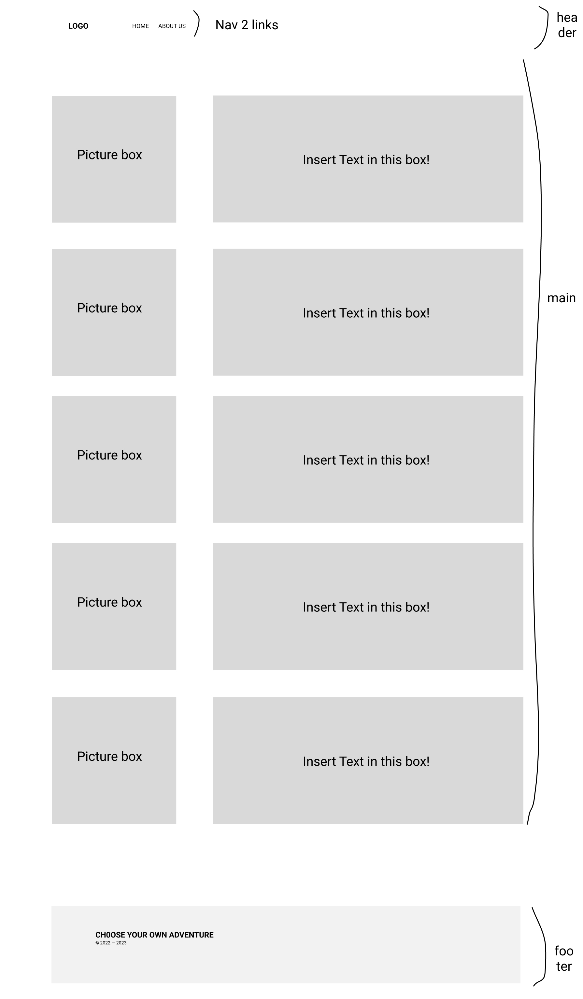
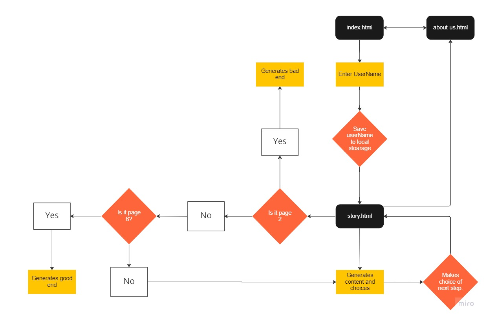

# choose-your-own-adventure-201

## Assignments
- [Project Prep - PM Tool](https://github.com/orgs/Choose-your-own-adventure-201/projects/1)

## Collaborators
- Dennis Palucki, Steve Gant, Marco Villafana, Benjamin Rude, Yaz Ahmed

## Wireframe

<<<<<<< HEAD
## Domain Model

=======
## Attributions

>>>>>>> e6ce1289eefd54b2651b62d21209d0ee78a0864c
